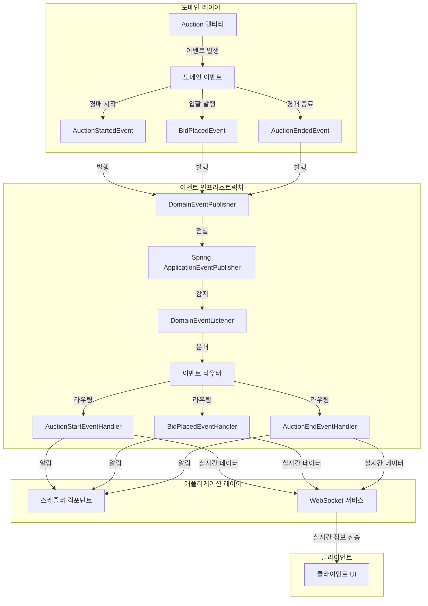

# 도메인 이벤트 아키텍처

## 주요 구성 요소

### 1. 도메인 레이어
- **도메인 엔티티**: Auction, Bid 등의 핵심 비즈니스 객체
- **도메인 이벤트**: 중요한 비즈니스 이벤트를 표현하는 불변 객체
  - AuctionStartedEvent: 경매 시작 시 발생
  - BidPlacedEvent: 입찰 발생 시 발생
  - AuctionEndedEvent: 경매 종료 시 발생

### 2. 이벤트 인프라스트럭처
- **DomainEventPublisher**: 도메인 이벤트를 발행하는 컴포넌트
- **ApplicationEventPublisher**: Spring의 이벤트 발행 메커니즘
- **DomainEventListener**: 이벤트를 수신하여 적절한 핸들러에게 전달
- **이벤트 핸들러**: 각 이벤트 타입에 특화된 처리 로직 구현

### 3. 애플리케이션 레이어
- **스케줄러 컴포넌트**: 시간 기반 작업 처리 (경매 시작/종료 자동화)
- **WebSocket 서비스**: 실시간 양방향 통신 제공

### 4. 클라이언트
- **클라이언트 UI**: 실시간 경매 정보를 표시하는 사용자 인터페이스
